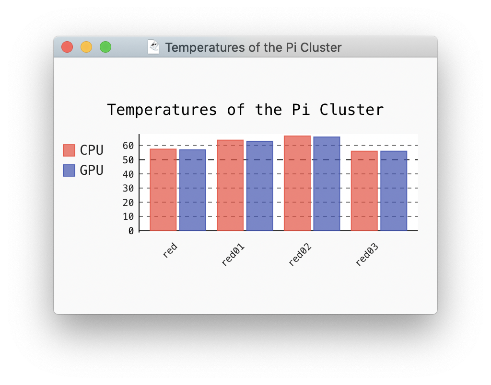
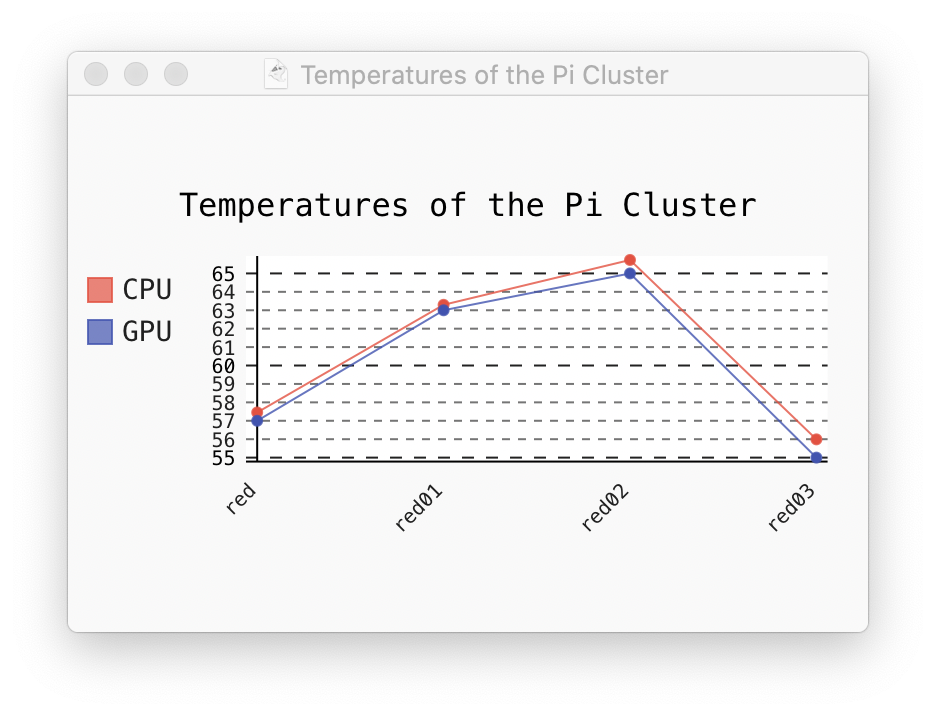
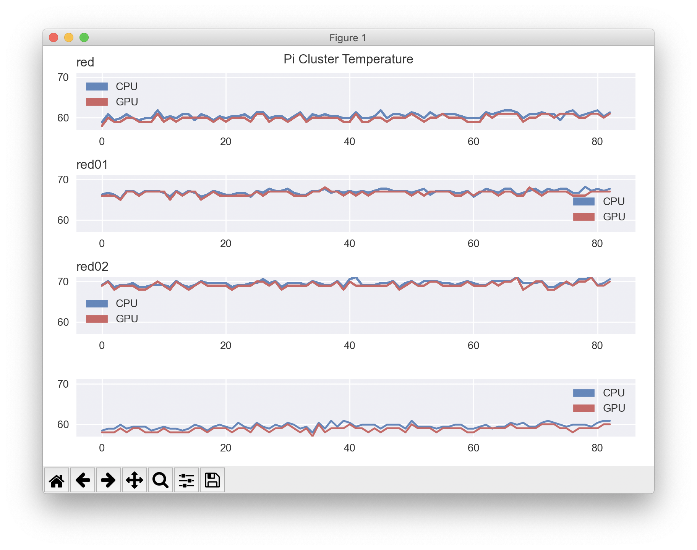

# Documentation


[](https://travis-ci.org/TankerHQ/cloudmesn-pi)
[](https://pypi.org/project/cloudmesh-pi)
[](https://pypi.org/project/cloudmesh-pi/)
[](https://github.com/TankerHQ/python-cloudmesh-pi/blob/master/LICENSE)


<!--TOC-->

- [Documentation](#documentation)
  - [About](#about)
  - [Installation](#installation)
    - [Creating the SD Cards](#creating-the-sd-cards)
    - [Prerequisite](#prerequisite)
    - [User install](#user-install)
    - [Developer install](#developer-install)
  - [Using the Cluster commands](#using-the-cluster-commands)
    - [Getting Help](#getting-help)
    - [Setting LEDS](#setting-leds)
    - [Getting the Temperature](#getting-the-temperature)
  - [Memory](#memory)
    - [Getting the Load Average](#getting-the-load-average)
    - [Stress test](#stress-test)
  - [Other Monitoring programs](#other-monitoring-programs)
  - [Manual Pages](#manual-pages)
    - [Pi Command](#pi-command)
    - [Bridge Command](#bridge-command)

<!--TOC-->

This README is managed in 

* [README.md](https://github.com/cloudmesh/cloudmesh-pi-cluster/blob/master/README.md)
* <https://github.com/cloudmesh/cloudmesh-pi-cluster>


## About

This document describes how to set up a variety of cluster platforms
on a number of Raspberry Pi's. We used Pi3B+ and Pi4 with 32 GB SD
cards.  You will ideally want to have a minimum of 3 Pi's.

In addition to this document, we have additional we have separate
documents that showcase how to convert your cluster into a

* [Spark Cluster (under development)](cloudmesh/cluster/spark/README.md)
* [Hadoop Cluster (under development)](cloudmesh/cluster/hadoop/README.md)
* [Kubernetes Cluster (under development)](https://github.com/cloudmesh/cloudmesh-pi-cluster/tree/main/cloudmesh/pi/cluster/k3)
* [MongoDB Cluster (under development)](cloudmesh/cluster/mongo/README.md)

## Installation

### Creating the SD Cards

We have chosen not to use network booting, but boot from the SD Cards.
For this, we use our unique `burn` program to burn the Pi's. This
allows you to immediately start with an OS that has all the needed
information on it. However, we need one master py that we configure
with the pi imager.

TODO: point to the documentation

TODO: Briefly describe how we burn the master and set it up

TODO: Then describe briefly how we burn


### Prerequisite

Once you have set up the master and have network access, you must
conduct the following steps

First, we update the system and install python3 in ~/ENV3 with the
command, activate it and generate an ssh key

```bash
curl -Ls http://cloudmesh.github.io/get/pi | sh
source ~/ENV3/bin/activate
ssh-keygen
```

These steps have only to be done once on your master Pi.


### User install

The installation for cloudmesh on the Pi cluster package is simple:

```bash
pip install cloudmesh-pi-cluster
```

### Developer install

In case you like to contribute to the code, we provide a convenient
mechanism for you to download all source code repositories from Git. You
find in the directory where you downloaded the code all source
code. The reason we recommend that you do this in a directory cm is that
it is the same for all developers and that all the source code is
located in one directory.

```bash
mkdir ~/cm
cd cm
cloudmesh-installer get pi
```

## Using the Cluster commands

### Getting Help

To get a list of commands related to the cloudmesh cluster use

```
cms help
```

To list the cluster command manual page use

```
cms help pi
```

to show the usage use

```
cms pi
```


### Setting LEDS

In case you want to signal which Pi is which we can leverage the on
board LEDs. You have a green and red LED that you can control as follows:


``` bash
$ cms pi led green on
$ cms pi led green off
$ cms pi led red on
$ cms pi led red off
```

### Getting the Temperature

Sometimes it is useful to view the temperature of the PI's as it could
have performance issues due to overheating, and the PIs are forced to
throttle. Hence it is a good idea to vent your Pis very well

Please note that the times are not exact as there is a slight delay
between getting the data and getting the data from the Pi.

```bash
cms pi temp "red,red[01-03]"
+-------+--------+------+----------------------------+
| host  | cpu    | gpu  | date                       |
+-------+--------+------+----------------------------+
| red   | 56.965 | 56.0 | 2020-03-28 14:34:46.926618 |
| red01 | 62.322 | 62.0 | 2020-03-28 14:34:46.949065 |
| red02 | 65.731 | 65.0 | 2020-03-28 14:34:46.933548 |
| red03 | 55.017 | 54.0 | 2020-03-28 14:34:47.218047 |
+-------+--------+------+----------------------------+
```

#### Watching the temperature continuously

To watch the temperature continuously in the terminal, use a repeat rate.  
To end the  program press `CTRL-C`

```bash
cms pi temp "red,red[01-03]" --rate=1.0
```

#### Sparkline

You can also get the temperature as sparkline with

```bash
cms pi temp "red,red[01-03]"  --output=sparkline
▄▆█▃
```

#### Bar

A Bar graph is created with

```bash
cms pi temp "red,red[01-03]"  --output=bar
```

<!--
{: width="400"}
-->


#### Line

A line graph is created with

```bash
cms pi temp "red,red[01-03]"  --output=line
```

<!--

-->


#### Browser

The output can also be looked at in a browser

```bash
cms pi temp "red,red[01-03]"  --output=browser
```

<!--

-->


#### Live animation

A live animation is available with

```bash
cms pi temp "red,red[01-03]" --rate=1 --output=live
```

<!--

-->


## Memory

```bash
cms pi free "red,red[01-03]" --rate=1
```

```
+-------+-----------+----------+----------+------------+-----------+-----------+------------+-----------+-----------+
| host  | mem.total | mem.used | mem.free | mem.shared | mem.cache | mem.avail | swap.total | swap.used | swap.free |
+-------+-----------+----------+----------+------------+-----------+-----------+------------+-----------+-----------+
| red   | 4.1 GB    | 109.5 MB | 3.8 GB   | 42.4 MB    | 188.2 MB  | 3.8 GB    | 104.9 MB   | 0 Bytes   | 104.9 MB  |
| red01 | 4.1 GB    | 99.8 MB  | 3.8 GB   | 34.0 MB    | 177.1 MB  | 3.8 GB    | 104.9 MB   | 0 Bytes   | 104.9 MB  |
| red02 | 4.1 GB    | 108.8 MB | 3.8 GB   | 34.0 MB    | 176.1 MB  | 3.8 GB    | 104.9 MB   | 0 Bytes   | 104.9 MB  |
| red03 | 4.1 GB    | 100.5 MB | 3.8 GB   | 34.0 MB    | 176.4 MB  | 3.8 GB    | 104.9 MB   | 0 Bytes   | 104.9 MB  |
+-------+-----------+----------+----------+------------+-----------+-----------+------------+-----------+-----------+
```

This can also be invoked repeatedly with

```
cms pi free "red,red[01-03]" --rate=1.0
```

### Getting the Load Average

The load average can be obtained with

```

cms pi load "red,red[01-03]" --rate=1

+-------+-------+-------+------+--------------+------------+
| host  | 1     | 5     | 10   | proc.running | proc.total |
+-------+-------+-------+------+--------------+------------+
| red   | 10.01 | 10.04 | 9.58 | 1            | 142        |
| red01 | 0.01  | 0.02  | 0.0  | 1            | 125        |
| red02 | 0.03  | 0.04  | 0.01 | 1            | 128        |
| red03 | 0.09  | 0.08  | 0.02 | 1            | 125        |
+-------+-------+-------+------+--------------+------------+
```

We have the same formats available just as in the temperature monitor.
Most useful is the live data which you can obtain with

```
cms pi load "red,red[01-03]" --rate=1 --output=graph
```

### Stress test

To put some load on the system, you can use the command stress-ng

* <https://manpages.ubuntu.com/manpages/artful/man1/stress-ng.1.html#examples>

It can be installed on a PI with

```
sudo apt-get install -y stress-ng
```

A  memory test can be started with

```
stress-ng --vm 8 --vm-bytes 80% -t 1h
```

When watching with

```
cms pi load "red,red[01-03]" --rate=1 --output=graph
```

You will see the graph reacting to it.

## Other Monitoring programs

Other Monitoring programs include

```
mpstat -P ALL
nmon
```

Please make sure you install them first before using them


## Manual Pages

### Pi Command

<!--MANUAL-PI-->
```
  pi led reset [NAMES]
  pi led (red|green) VALUE
  pi led (red|green) VALUE NAMES [--user=USER]
  pi led list NAMES [--user=USER]
  pi led blink (red|green) NAMES [--user=USER] [--rate=SECONDS]
  pi led sequence (red|green) NAMES [--user=USER] [--rate=SECONDS]
  pi temp NAMES [--rate=RATE] [--user=USER] [--output=FORMAT]
  pi free NAMES [--rate=RATE] [--user=USER] [--output=FORMAT]
  pi load NAMES [--rate=RATE] [--user=USER] [--output=FORMAT]
  pi hadoop setup [--master=MASTER] [--workers=WORKERS]
  pi hadoop start [--master=MASTER] [--workers=WORKERS]
  pi hadoop stop [--master=MASTER] [--workers=WORKERS]
  pi hadoop test [--master=MASTER] [--workers=WORKERS]
  pi hadoop check [--master=MASTER] [--workers=WORKERS]
  pi spark setup [--master=MASTER] [--workers=WORKERS]
  pi spark start --master=MASTER
  pi spark stop --master=MASTER
  pi spark test --master=MASTER
  pi spark check [--master=MASTER] [--workers=WORKERS]
  pi spark uninstall --master=MASTER [--workers=WORKERS]
  pi k3 install [--master=MASTER] [--workers=WORKERS] [--step=COMMAND]
  pi k3 join --master=MASTER --workers=WORKERS
  pi k3 uninstall [--master=MASTER] [--workers=WORKERS]
  pi k3 delete [--master=MASTER] [--workers=WORKERS]
  pi k3 test [--master=MASTER] [--workers=WORKERS]
  pi k3 view
  pi script list SERVICE [--details]
  pi script list SERVICE NAMES
  pi script list
  pi wifi SSID [PASSWORD] [--dryrun]

This command does some useful things.

Arguments:
    FILE   a file name

Options:
    -f      specify the file


Description:

  This command switches on and off the LEDs of the specified PIs. If
  the hostname is ommitted. IT is assumed that the code is executed on
  a PI and its LED are set. To list the PIs LED status you can use the
  list command

  Examples:

      cms pi led list  "red,red[01-03]"

          lists the LED status of the given hosts

      cms pi led red off  "red,red[01-03]"

          switches off the led of the given PIs

      cms pi led red on  "red,red[01-03]"

          switches on the led of the given PIs

      cms pi led red blink  "red,red[01-03]"

          switches on and off the led of the given PIs

      cms pi led red sequence  "red,red[01-03]"

          goes in sequential order and switches on and off the led of
          the given PIs

```
<!--MANUAL-PI-->


### Bridge Command

<!--MANUAL-BRIDGE-->
```
  bridge create [--interface=INTERFACE] [--ip=IPADDRESS] [--range=IPRANGE] [--purge]
  bridge set HOSTS ADDRESSES 
  bridge restart [--nohup] [--background]
  bridge status
  bridge test HOSTS [--rate=RATE]
  bridge list NAMES
  bridge check NAMES [--configuration] [--connection]
  bridge info

Arguments:
    HOSTS        Hostnames of connected devices. 
                 Ex. red002
                 Ex. red[002-003]

    ADDRESSES    IP addresses to assign to HOSTS. Addresses
                 should be in the network range configured.
                 Ex. 10.1.1.2
                 Ex. 10.1.1.[2-3]

    NAMES        A parameterized list of hosts. The first hostname 
                 in the list is the master through which the traffic 
                 is routed. Example:
                 blue,blue[002-003]

Options:
    --interface=INTERFACE  The interface name [default: eth1]
                           You can also specify wlan0 if you wnat
                           to bridge through WIFI on the master
                           eth0 requires a USB to WIFI adapter

    --ip=IPADDRESS         The ip address [default: 10.1.1.1] to
                           assign the master on the
                           interface. Ex. 10.1.1.1

    --range=IPRANGE        The inclusive range of IPs that can be
                           assigned to connecting devices. Value
                           should be a comma separated tuple of the
                           two range bounds. Should not include the
                           ip of the master Ex. 10.1.1.2-10.1.1.20
                           [default: 10.1.1.2-10.1.1.122]

    --workers=WORKERS      The parametrized hostnames of workers
                           attatched to the bridge.
                           Ex. red002
                           Ex. red[002-003]

    --purge                Include option if a full reinstallation of
                           dnsmasq is desired

    --background           Runs the restart command in the background.
                           stdout to bridge_restart.log

    --nohup                Restarts only the dnsmasq portion of the
                           bridge. This is done to surely prevent
                           SIGHUP if using ssh.

    --rate=RATE            The rate in seconds for repeating the test
                           If ommitted its done just once.

Description:

  Command used to set up a bride so that all nodes route the traffic
  trough the master PI.

  bridge create [--interface=INTERFACE] [--ip=IPADDRESS] [--range=IPRANGE]
      creates the bridge on the current device
      The create command does not restart the network.

  bridge set HOSTS ADDRESSES 
      the set command assigns the given static 
      ip addresses to the given hostnames.

  bridge status
      Returns the status of the bridge and its linked services.

  bridge restart [--nohup]
      restarts the bridge on the master without rebooting. 

  bridge test NAMES
      A test to see if the bridges are configured correctly and one
      hase internet access on teh specified hosts.

  bridge list NAMES
      Lists information about the bridges (may not be needed)

  bridge check NAMES [--config] [--connection]
      provides information about the network configuration
      and netwokrk access. Thisis not a comprehensive speedtest
      for which we use test.

  bridge info
      prints relevant information about the configured bridge


Design Changes:
  We still may need the master to be part of other commands in case
  for example the check is different for master and worker

```
<!--MANUAL-BRIDGE-->

## History

### Versions

* `prebranch` -- this is the code prior to us creating branches for
  kubernetes, and map reduce.  map reduce contains spak and
  hadoop. However as these efforts wer just starting, they may confuse
  others. Thus it was important to separate them so we have a clear
  distinction betwen production and development.

* `02-03-2021` -- This is a branch done after prebranch, where all
  experimental code has been removed and placed into its seperate
  branches. The removal includes kubernetes, mongo, spark,
  hadoop. proxy and sdcard contained some documentation, that was
  moved to README-proxy.md and benchmar/sdcard-benchmark.md

### Branches

* main: our main branch for production releases

* dev: a general branch that is used prior to the production release
  with active fixes

* kubernetes: a branch in which we coordinate the implemnetation of
  easy kubernetes deplyments

* mapreduce: a branch in which we coordinate hadoop and spark
  deployments. There is a temprrary solution in her, but we have not
  tested is and I woudl consider the status as pre alphs. It needs t o
  be redone.

* with-dhcp-server: Some intermediate development

* mongo: distributed deployment of mongo. This branch is essentially
  empty. We may delete it due to inactivity.


