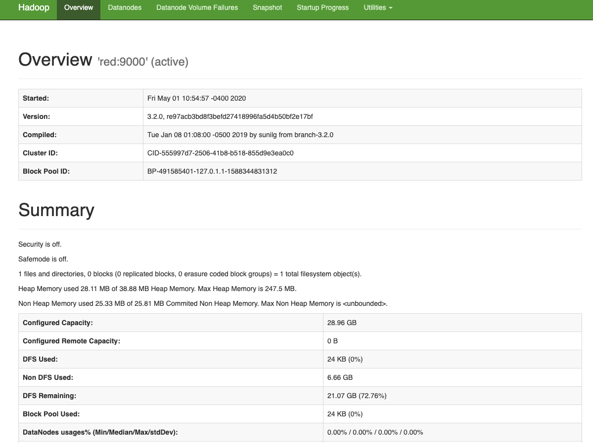

# Setting up a Pi Hadoop Cluster

# Hadoop with Raspberry Pi Jessica Zhu sp20-516-252

** This manual is for Hadoop single node set up. For cluster setup, go to [here](https://github.com/cloudmesh/cloudmesh-pi-cluster/blob/master/cloudmesh/pi/cluster/hadoop/README_cluster.md)

Reference for Pi cluster setup:

<https://github.com/cloudmesh/cloudmesh-pi-burn>
<https://github.com/cloudmesh/cloudmesh-pi-cluster>
<https://github.com/cloudmesh/cloudmesh-pi-cluster/blob/master/cloudmesh/bridge/README.md>

Run the commands below to fix the numpy installation issue from cloudmesh.

```
$ echo "Y" | sudo apt install libatlas3-base libgfortran5
$ sudo pip3 install numpy
```

## Setup master 

 -- TODO: SAME SETUP ON WORKERS

The setup includes the installation of java, jps and Hadoop on master. 

```
$ cms pi hadoop setup --master=red
$ source ~/.bashrc
```


If the installation is successful, you should see the versions of each
 returned by running these commands below. The number in front of jps can be
  different.

```
$ java -version
openjdk version "1.8.0_212"
OpenJDK Runtime Environment (build 1.8.0_212-8u212-b01-1+rpi1-b01)
OpenJDK Client VM (build 25.212-b01, mixed mode)
$ jps
11630 Jps
$ cd && hadoop version | grep Hadoop
Hadoop 3.2.0
```

Now set up passwordless ssh on the localhost and configure Hadoop properly by
 running the commands below. These lines only need to be run once for the
  cluster.

```
$ sh ~/cm/cloudmesh-pi-cluster/cloudmesh/pi/cluster/hadoop/bin/master-start-hadoop.sh
$ source ~/.bashrc
$ sh ~/cm/cloudmesh-pi-cluster/cloudmesh/pi/cluster/hadoop/bin/master-hadoop-config.sh
$ cat ~/.ssh/id_rsa.pub >> ~/.ssh/authorized_keys
```

## Start, Stop, Test and Check Hadoop on Master

    --TODO: MORE FUNCTIONS ON WORKERS AS WELL

  - **Start**
  
```
$ cms pi hadoop start --master=red
```

If the start is successful, you can see six items are running in the
 background by typing the command below. If any one is missing, Hadoop might
  not be able to work properly, in which case you should stop and restart
   hadoop.

```
$ jps
2736 NameNode
2850 DataNode
3430 NodeManager
3318 ResourceManager
3020 SecondaryNameNode
3935 Jps
```

Check the node online, type in `http://red:9870` on web browser
You should see a web page showing resources. `http://red:8088` shows nodes of
 the cluster. 



  - **Stop**

```
$ cms pi hadoop stop --master=red
```

  - **Test**
 
This command starts Hadoop, run a π calculation (2 maps, 5 samples per map
) and stop Hadoop. You should see output like this 

```
$ cms pi hadoop test --master=red
....
Job Finished in 40.183 seconds
Estimated value of Pi is 3.60000000000000000000
['red'] -> $HADOOP_HOME/sbin/stop-all.sh
....
Stopping resourcemanager
[]
```

   - **Check**

This command returns hostname, and hardware information of Pi.

```
$ cms pi hadoop check --master=red
```

## Example: Calculation of π

Hadoop comes with sample file for computation. Once you have started the cluster
, you can run one of the examples to calculate the value of π.

```
$ hadoop jar /opt/hadoop/share/hadoop/mapreduce/hadoop-mapreduce-examples-3.2.0.jar pi 2 5
```
Here we have set `number of maps` = 2 and `samples per map` = 5.

A returned result would be close to
```
...
Job Finished in 35.558 seconds
Estimated value of Pi is 3.60000000000000000000
```
You can change Hadoop parameters to get a value with a higher precision π
. This time we have set `number of maps` = 16 and `samples per map` = 1000.

```
$ hadoop jar /opt/hadoop/share/hadoop/mapreduce/hadoop-mapreduce-examples-3.2.0.jar pi 16 1000
...
Job Finished in 64.2 seconds
Estimated value of Pi is 3.15000000000000000000
```

## references
1. <https://gist.github.com/filipelenfers/ef3f593deb0751944bb54b744bcac074>
2. <https://dev.to/awwsmm/building-a-raspberry-pi-hadoop-spark-cluster-8b2#hadoopspark>
3. <https://tecadmin.net/setup-hadoop-single-node-cluster-on-centos-redhat/>


-- WORKED UP TO HERE
## install Java on master and workers

Hadoop requires Java. Raspbian Desktop doesn't come with Java installed
, we therefore need to install java on all of the Pi.

### Install Java on worker nodes

Since workers don't have access to network, java can be installed by master
 passing the installation package to workers.
 
 Ensure you can ssh into workers without password
 
 ## (ENSURE YOU HAVE INPUT TAKE THE NUMBER OF WORKERS)
 
 ```buildoutcfg
$ ssh red001
$ ssh red002
```
 
 run command 
  ```
sh master-to-worker.sh
```

Now that each worker has the right java zip package, we are gonna upzip and
 install java on each worker using just one line from master:
 
 This py file is in cloudmesh-common (this JobMultiHostScript.py needs to be
  motified till the source code is fixed)
 ```
cd ~/cm/cloudmesh-common/cloudmesh/common
sudo nano JobMultiHostScript.py
```
 ```
 import sys
 
 def main():
    # EXAMPLE FOR TERMINAL - python JobMultiHostScript.py [SCRIPT-FILE] [HOSTS]
    argumentCounter = 0
    for arg in sys.argv[1:]:
        # Script file
        if argumentCounter == 0:
            scriptFile = arg
        # Get hosts
        else:
            hosts = arg
        argumentCounter = argumentCounter + 1
    with open(scriptFile) as f:
        script = f.readlines()
    script = ''.join(script)
    hosts = Parameter.expand(hosts)
    result = JobMultiHostScript.execute(script, "terminal_script", hosts)
if __name__ == '__main__':
    main()
    """script =
    # This is a comment
    # Task: pwd
    pwd     # tag: pwd
    # Task:  uname
    uname -a
    "";
    hosts = Parameter.expand("purple[01-02]")
    result = JobMultiHostScript.execute(script, "script_name", hosts,
                                        beginLine="# Task: pwd", endLine="# Task: uname")
    """

 ```
 
 `python JobMultiHostScript.py ~/cm/cloudmesh-pi-cluster/cloudmesh/pi/cluster/hadoop/bin/worker-installation.sh red[001-002]`

If it is installed successfully on workers, you should see returns similar to
 this. Basically, stdout shouldnt tell you there is any error.
 
```
{'red001': {'command': 'java -version',
            'host': 'red001',
            'name': 'red001',
            'returncode': 0,
            'status': 'done',
            'stderr': '',
            'stdout': b''},
 'red002': {'command': 'java -version',
            'host': 'red002',
            'name': 'red002',
            'returncode': 0,
            'status': 'done',
            'stderr': '',
            'stdout': b''}}
```

--- Below Configuration info for single node hadoop


Edit core-site.xml

```
<configuration>
<property>
  <name>fs.default.name</name>
    <value>hdfs://red:9000</value>
</property>
</configuration>
```

Edit hdfs-site.xml

```
<configuration>
<property>
 <name>dfs.replication</name>
 <value>1</value>
</property>

<property>
  <name>dfs.name.dir</name>
    <value>file:///opt/hadoop/hadoopdata/hdfs/namenode</value>
</property>

<property>
  <name>dfs.data.dir</name>
    <value>file:///opt/hadoop/hadoopdata/hdfs/datanode</value>
</property>
</configuration>
```

Edit mapred-site.xml

```
<configuration>
  <property>
    <name>mapreduce.framework.name</name>
    <value>yarn</value>
  </property>
<property>
 <name>yarn.app.mapreduce.am.env</name>
 <value>HADOOP_MAPRED_HOME=$HADOOP_HOME</value>
</property>
<property>
 <name>mapreduce.map.env</name>
 <value>HADOOP_MAPRED_HOME=$HADOOP_HOME</value>
</property>
<property>
 <name>mapreduce.reduce.env</name>
 <value>HADOOP_MAPRED_HOME=$HADOOP_HOME</value>
</property>
</configuration>

```
Edit yarn-site.xml

```
<configuration>
 <property>
  <name>yarn.nodemanager.aux-services</name>
    <value>mapreduce_shuffle</value>
 </property>
</configuration>
```

---


## create cluster with multiple Pi

# copy and install hadoop on workers

scp -r /home/pi/hadoop-3.2.0.tar.gz red001:
ssh red001
sudo tar -xvzf hadoop-3.2.0.tar.gz -C /opt/
sudo mv /opt/hadoop-3.2.0 /opt/hadoop
sudo chown pi:pi -R /opt/hadoop

# install jps
sudo nano ~/.bashrc
alias jps='/opt/jdk/bin/jps'
source ~/.bashrc
jps

# remove hdfs folder files on master

cd ~/opt/hadoop/hadoopdata/hdfs

# Set hadoop env on Worker

ssh red001
sudo nano  /opt/hadoop/etc/hadoop/hadoop-env.sh
   export JAVA_HOME=/opt/jdk/jre

core-site.xml

```
<configuration>
<property>
  <name>fs.default.name</name>
    <value>hdfs://red:9000</value>
</property>
</configuration>
```

hdfs-site.xml

```
<configuration>
<property>
 <name>dfs.replication</name>
 <value>2</value>
</property>

<property>
  <name>dfs.name.dir</name>
    <value>file:///opt/hadoop/hadoopdata/hdfs/namenode</value>
</property>

<property>
  <name>dfs.data.dir</name>
    <value>file:///opt/hadoop/hadoopdata/hdfs/datanode</value>
</property>
</configuration>

```

mapred-site.xml

```
<configuration>
  <property>
    <name>mapreduce.framework.name</name>
    <value>yarn</value>
  </property>
<property>
 <name>yarn.app.mapreduce.am.env</name>
 <value>HADOOP_MAPRED_HOME=$HADOOP_HOME</value>
</property>
<property>
 <name>mapreduce.map.env</name>
 <value>HADOOP_MAPRED_HOME=$HADOOP_HOME</value>
</property>
<property>
 <name>mapreduce.reduce.env</name>
 <value>HADOOP_MAPRED_HOME=$HADOOP_HOME</value>
</property>
</configuration>
```

yarn-site.xml

```
<?xml version="1.0"?>

<configuration>
 <property>
  <name>yarn.nodemanager.aux-services</name>
    <value>mapreduce_shuffle</value>
 </property>
</configuration>
```


